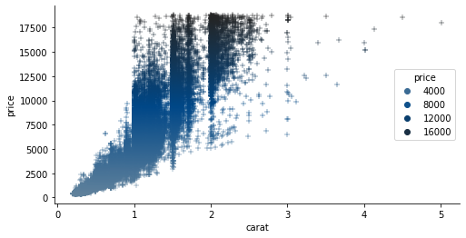
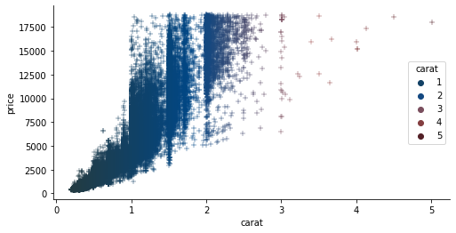

# palettes

[](http://www.repostatus.org/#concept)
[](https://github.com/dirmeier/palettes/actions?query=workflow%3Aci)

## About 
 
This package contains some of my color palettes for usage in Python. One can choose between qualitative, diverging and sequential color palettes depending on the type of variable to be visualized 

## Installation

To install the latest GitHub release, just call the following on the command line:

```bash
pip install git+https://github.com/dirmeier/palettes
```

## Usage

`palettes` works with both `matplotlib` or `seaborn`. You can either manually specify colors or provide matplotlib color maps. Below, we briefly demonstrate how to use the package.


```python
import numpy as np
%matplotlib inline
import matplotlib.pyplot as plt
import seaborn as sns

import palettes
from palettes.plot import plot_palette
```

Set a custom theme for matplotlib:


```python
palettes.set_theme()
```

For visualization we use the well-known diamonds data:


```python
diamonds = sns.load_dataset("diamonds")
```

### Sequential colors 

Sequential colors are usually chosen for continuous variables. The sequential colors here revolve around the following three colors:


```python
plot_palette(palettes.discrete_sequential_colors())
```


    

    


In the visualization above we use three discrete colors, but you can also choose more:


```python
plot_palette(palettes.discrete_sequential_colors(10))
```


    

    


```python
plot_palette(palettes.discrete_sequential_colors(10, True))
```


    

    


Usually for continuous variables, we want a continous scale though:


```python
plot_palette(palettes.continuous_sequential_colors())
```


    

    


In a plot, we use the color scheme like this:


```python
f, ax = plt.subplots(figsize=(8, 4))
sns.scatterplot(
    x="carat", y="price",
    hue="price",
    palette=palettes.continuous_sequential_colors(),
    data=diamonds, ax=ax
);
```


    <AxesSubplot:xlabel='carat', ylabel='price'>


    

    


### Diverging colors 

Diverging colors are usually chosen for continuous variables that can deviate in one of two directions relative to some midpoint. The diverging colors here revolve around the following four colors:


```python
plot_palette(palettes.discrete_diverging_colors())
```


    

    


As above, you can specify more colors, too, and reverse them:


```python
plot_palette(palettes.discrete_diverging_colors(10, True))
```


    

    


Since the visualized variable is usually continuous again, you want a continous scale again:


```python
plot_palette(palettes.continuous_diverging_colors())
```


    

    


For plotting, we use the palette as before. In this case the midpoint would be if a diamond has 3 carats.


```python
f, ax = plt.subplots(figsize=(8, 4))
sns.scatterplot(
    x="carat", y="price",
    hue="carat",
    palette=palettes.continuous_diverging_colors(),
    data=diamonds, ax=ax
);
```


    <AxesSubplot:xlabel='carat', ylabel='price'>


    

    


### Qualitative colors 

Qualitative colors are usually chosen for categorical variables. The qualitative colors palette has the following colors:


```python
plot_palette(palettes.discrete_qualitative_colors())
```


    

    


The palette has a maximum of 6 colors. I've chosen to use only 6, because humans are usually not good at congitively processing 4-5 colors in a plot, so 6 is a hard maximum. 

For qualitative variables with more than 6 levels, I usually prefer to plot the with in a light blue sequential scale, since one cannot distinguish the colors effectively any more anyways. Alternatively one can use a greyscale for the variables, and highlight some few with colors.

## Author

Simon Dirmeier <a href="mailto:simon.dirmeier @ web.de">simon.dirmeier @ web.de</a>
