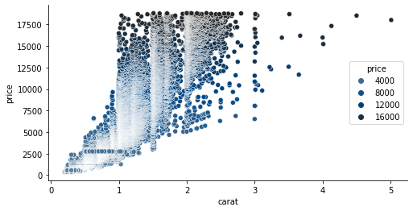
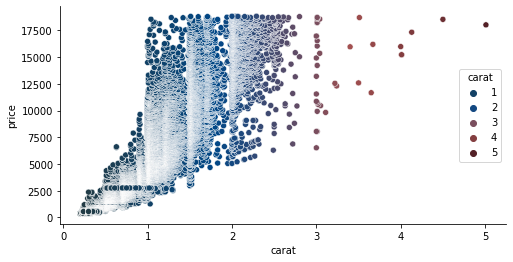

# Color palettes

This notebooks demonstrates the use of my custom color palettes. Depending on the type of variable to be visualized you can choose between qualitative, diverging and sequential color palettes.


```python
import numpy as np
%matplotlib inline
import matplotlib.pyplot as plt
import seaborn as sns

import palettes
```

Set a custom theme for matplotlib:


```python
palettes.set_theme()
```

For visualization we use the well-known diamonds data:


```python
diamonds = sns.load_dataset("diamonds")
```

## Sequential colors 

Sequential colors are usually chosen for continuous variables. The sequential colors here revolve around the following three colors:


```python
palettes.discrete_sequential_colors()
```


<svg  width="165" height="55"><rect x="0" y="0" width="55" height="55" style="fill:#61829c;stroke-width:2;stroke:rgb(255,255,255)"/><rect x="55" y="0" width="55" height="55" style="fill:#004787;stroke-width:2;stroke:rgb(255,255,255)"/><rect x="110" y="0" width="55" height="55" style="fill:#252525;stroke-width:2;stroke:rgb(255,255,255)"/></svg>


In the visualization above we use three discrete colors, but you can also choose more:


```python
palettes.discrete_sequential_colors(10)
```


<svg  width="550" height="55"><rect x="0" y="0" width="55" height="55" style="fill:#61829c;stroke-width:2;stroke:rgb(255,255,255)"/><rect x="55" y="0" width="55" height="55" style="fill:#4c7597;stroke-width:2;stroke:rgb(255,255,255)"/><rect x="110" y="0" width="55" height="55" style="fill:#366893;stroke-width:2;stroke:rgb(255,255,255)"/><rect x="165" y="0" width="55" height="55" style="fill:#205b8e;stroke-width:2;stroke:rgb(255,255,255)"/><rect x="220" y="0" width="55" height="55" style="fill:#0b4e89;stroke-width:2;stroke:rgb(255,255,255)"/><rect x="275" y="0" width="55" height="55" style="fill:#04437c;stroke-width:2;stroke:rgb(255,255,255)"/><rect x="330" y="0" width="55" height="55" style="fill:#0c3c66;stroke-width:2;stroke:rgb(255,255,255)"/><rect x="385" y="0" width="55" height="55" style="fill:#153450;stroke-width:2;stroke:rgb(255,255,255)"/><rect x="440" y="0" width="55" height="55" style="fill:#1d2c3b;stroke-width:2;stroke:rgb(255,255,255)"/><rect x="495" y="0" width="55" height="55" style="fill:#252525;stroke-width:2;stroke:rgb(255,255,255)"/></svg>


```python
palettes.discrete_sequential_colors(10, True)
```


<svg  width="550" height="55"><rect x="0" y="0" width="55" height="55" style="fill:#252525;stroke-width:2;stroke:rgb(255,255,255)"/><rect x="55" y="0" width="55" height="55" style="fill:#1d2c3b;stroke-width:2;stroke:rgb(255,255,255)"/><rect x="110" y="0" width="55" height="55" style="fill:#153450;stroke-width:2;stroke:rgb(255,255,255)"/><rect x="165" y="0" width="55" height="55" style="fill:#0c3c66;stroke-width:2;stroke:rgb(255,255,255)"/><rect x="220" y="0" width="55" height="55" style="fill:#04437c;stroke-width:2;stroke:rgb(255,255,255)"/><rect x="275" y="0" width="55" height="55" style="fill:#0b4e89;stroke-width:2;stroke:rgb(255,255,255)"/><rect x="330" y="0" width="55" height="55" style="fill:#205b8e;stroke-width:2;stroke:rgb(255,255,255)"/><rect x="385" y="0" width="55" height="55" style="fill:#366893;stroke-width:2;stroke:rgb(255,255,255)"/><rect x="440" y="0" width="55" height="55" style="fill:#4c7597;stroke-width:2;stroke:rgb(255,255,255)"/><rect x="495" y="0" width="55" height="55" style="fill:#61829c;stroke-width:2;stroke:rgb(255,255,255)"/></svg>


Usually for continuous variables, we want a continous scale though:


```python
pal = palettes.continuous_sequential_colors()
```


```python
def plot_color_gradients(cmap):
    gradient = np.linspace(0, 1, 256)
    gradient = np.vstack((gradient, gradient))
    f, ax = plt.subplots(figsize=(8, 1))    
    ax.imshow(gradient, aspect='auto', cmap=cmap)        
    ax.set_axis_off()

plot_color_gradients(pal)
```


    

    


In a plot, we use the color scheme like this:


```python
f, ax = plt.subplots(figsize=(8, 4))
sns.scatterplot(
    x="carat", y="price",
    hue="price",
    palette=palettes.continuous_sequential_colors(),
    data=diamonds, ax=ax
);
```


    

    


## Diverging colors 

Diverging colors are usually chosen for continuous variables that can deviate in one of two directions relative to some midpoint. The diverging colors here revolve around the following four colors:


```python
palettes.discrete_diverging_colors()
```


<svg  width="220" height="55"><rect x="0" y="0" width="55" height="55" style="fill:#233b43;stroke-width:2;stroke:rgb(255,255,255)"/><rect x="55" y="0" width="55" height="55" style="fill:#004787;stroke-width:2;stroke:rgb(255,255,255)"/><rect x="110" y="0" width="55" height="55" style="fill:#a25050;stroke-width:2;stroke:rgb(255,255,255)"/><rect x="165" y="0" width="55" height="55" style="fill:#532026;stroke-width:2;stroke:rgb(255,255,255)"/></svg>


As above, you can specify more colors, too, and reverse them:


```python
palettes.discrete_diverging_colors(10, True)
```


<svg  width="550" height="55"><rect x="0" y="0" width="55" height="55" style="fill:#532026;stroke-width:2;stroke:rgb(255,255,255)"/><rect x="55" y="0" width="55" height="55" style="fill:#6d3034;stroke-width:2;stroke:rgb(255,255,255)"/><rect x="110" y="0" width="55" height="55" style="fill:#874042;stroke-width:2;stroke:rgb(255,255,255)"/><rect x="165" y="0" width="55" height="55" style="fill:#a25050;stroke-width:2;stroke:rgb(255,255,255)"/><rect x="220" y="0" width="55" height="55" style="fill:#6d4d62;stroke-width:2;stroke:rgb(255,255,255)"/><rect x="275" y="0" width="55" height="55" style="fill:#354a75;stroke-width:2;stroke:rgb(255,255,255)"/><rect x="330" y="0" width="55" height="55" style="fill:#004787;stroke-width:2;stroke:rgb(255,255,255)"/><rect x="385" y="0" width="55" height="55" style="fill:#0c4370;stroke-width:2;stroke:rgb(255,255,255)"/><rect x="440" y="0" width="55" height="55" style="fill:#173f59;stroke-width:2;stroke:rgb(255,255,255)"/><rect x="495" y="0" width="55" height="55" style="fill:#233b43;stroke-width:2;stroke:rgb(255,255,255)"/></svg>


Since the visualized variable is usually continuous again, you want a continous scale again:


```python
plot_color_gradients(palettes.continuous_diverging_colors())
```


    

    


For plotting, we use the palette as before. In this case the midpoint would be if a diamond has 3 carats.


```python
f, ax = plt.subplots(figsize=(8, 4))
sns.scatterplot(
    x="carat", y="price",
    hue="carat",
    palette=palettes.continuous_diverging_colors(),
    data=diamonds, ax=ax
);
```


    

    


## Qualitative colors 

Qualitative colors are usually chosen for categorical variables. The qualitative colors palette has the following colors:


```python
palettes.discrete_qualitative_colors()
```


<svg  width="330" height="55"><rect x="0" y="0" width="55" height="55" style="fill:#004787;stroke-width:2;stroke:rgb(255,255,255)"/><rect x="55" y="0" width="55" height="55" style="fill:#0d0b0c;stroke-width:2;stroke:rgb(255,255,255)"/><rect x="110" y="0" width="55" height="55" style="fill:#a25050;stroke-width:2;stroke:rgb(255,255,255)"/><rect x="165" y="0" width="55" height="55" style="fill:#61829c;stroke-width:2;stroke:rgb(255,255,255)"/><rect x="220" y="0" width="55" height="55" style="fill:#b2aaa2;stroke-width:2;stroke:rgb(255,255,255)"/><rect x="275" y="0" width="55" height="55" style="fill:#532026;stroke-width:2;stroke:rgb(255,255,255)"/></svg>


The palette has a maximum of 6 colors. I've chosen to use only 6, because humans are usually not good at congitively processing 4-5 colors in a plot, so 6 is a hard maximum. 

For qualitative variables with more than 6 levels, I usually prefer to plot the with in a light blue sequential scale, since one cannot distinguish the colors effectively any more anyways. Alternatively one can use a greyscale for the variables, and highlight some few with colors.
